# 电控环境配置指南

本文档旨在为准备进入电控的小登提供环境配置指南

author：rediduck，lary

v1.0：初始创建文档

v1.1：修复了冗余安装的问题

更新说明：cubemx插件会自动帮你下载cmaketool插件，不用自己下载；修复了错字

## CubeMX安装指南

>  CubeMX是使用stm32开发不可避免的一个工具，不管使用什么工作流都需要下载

1、搜索官网并注册个人账号（可能需要科学上网）

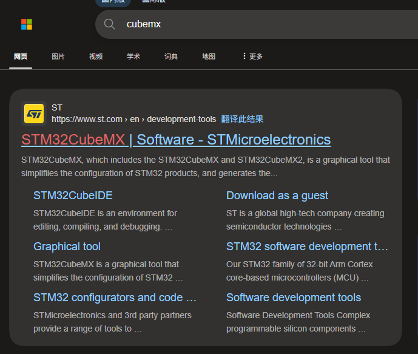

2、往下翻直到你看到了这个界面

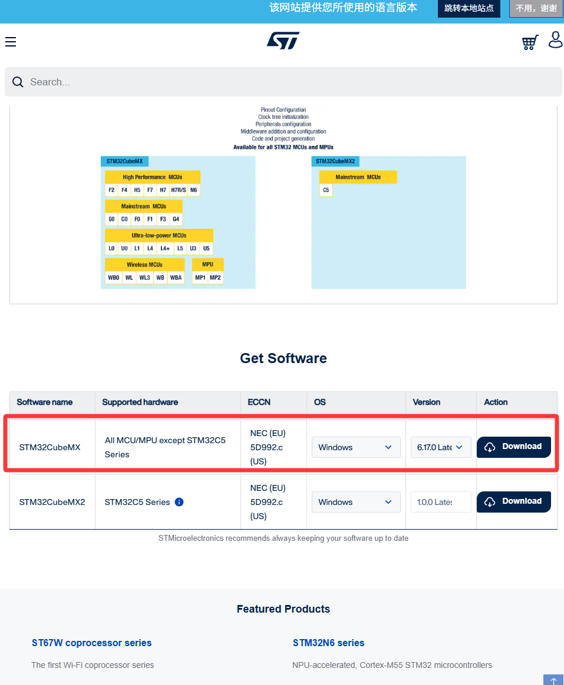

​	点击下载STM32CubeMX，不要下成2了（截至2026.9.6CubeMX2只支持部分芯片）

3、点击安装程序，跟着图片一步一步来

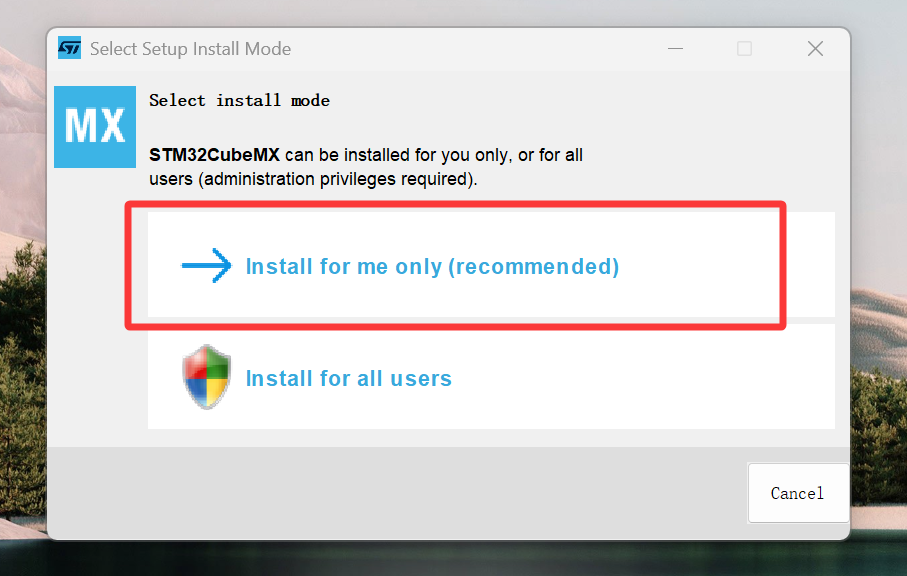

​								一路Next，直到这个界面

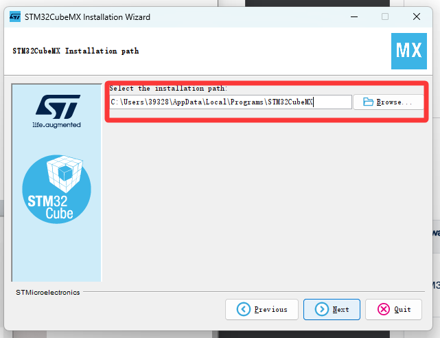

​		==选一个你能找到的路径安装==，可以不放在C盘。（然后就是静静等待下载）

4、接着你就会在桌面看到相应软件，点开它，检查软件更新并下载相应芯片驱动包

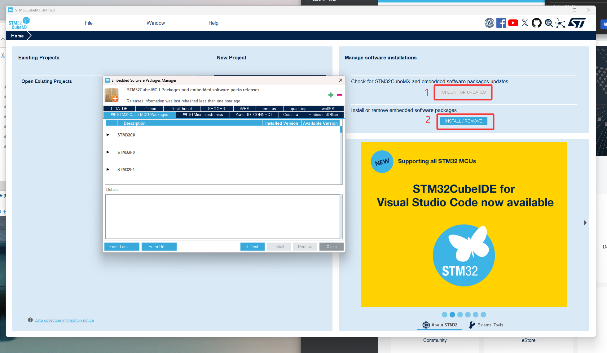

分别选取STM32F1和STM32F4系列最新的驱动包，点击下载

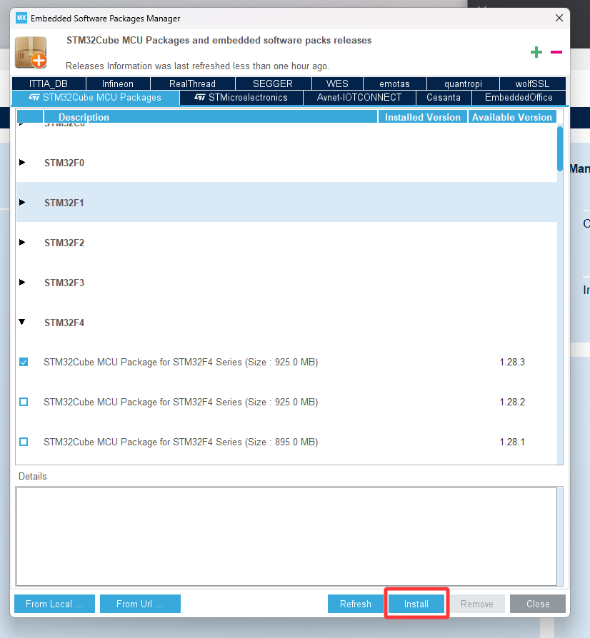

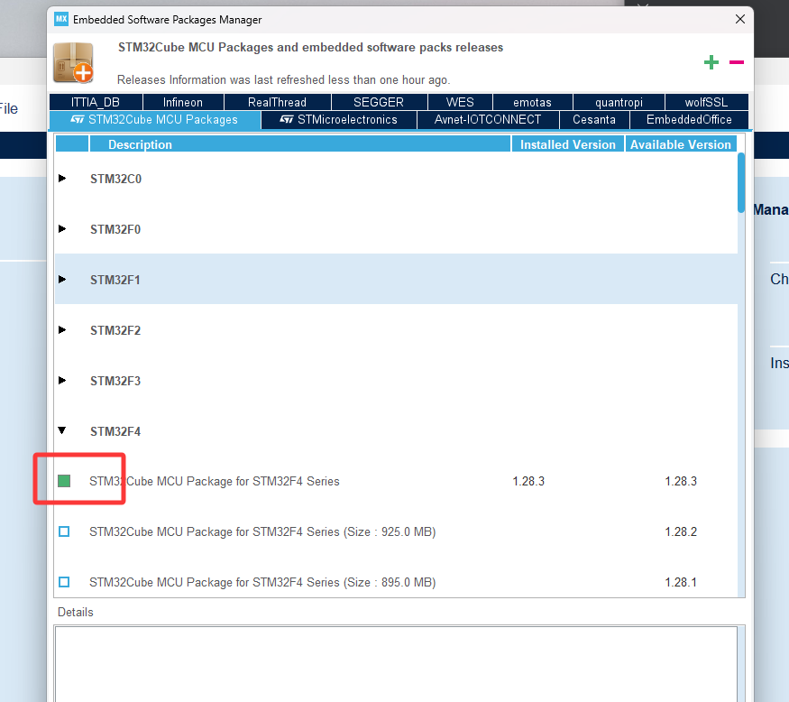

成功安装驱动包后会显示绿豆，后续使用cubemx时它可能会更新驱动包或者软件，下载保持在最新版本即可

安装完成后请看CubeMX使用教程

## OZONE+JLINK安装指南

- ozone各个版本都支持jlink，推荐Ozone3.24 32-bit和J-Link7.52，这一套可以支持jlink和dap-link的调试（包括ATK无线调试器）

- 先安装Ozone，再安装Jlink

1、搜索网址 https://www.segger.com/downloads/jlink/ ，安装3.24版本

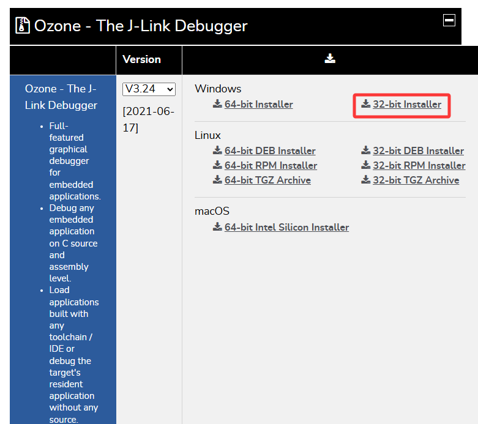

2、进入安装程序，next几次直到

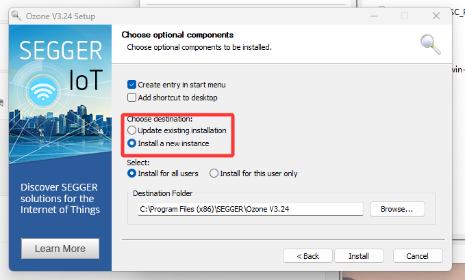

​	选择安装一个新实例，后续一路确认即可

3、回到官网，下载JLink驱动

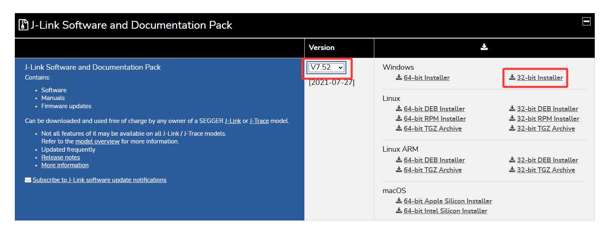

4、打开安装程序

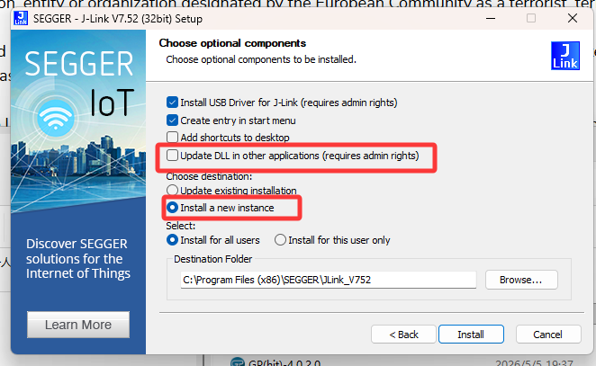

这一步注意不要勾选date dll in other application，否则jlink会把ozone里面老的驱动和启动项替代掉。choose destination和ozone一样，选择install a new instance。如果安装了老的相同版本的jlink，请先卸载（版本相同不用管，直接新装一个）

5、在开始菜单中搜索dll，选择这个程序运行

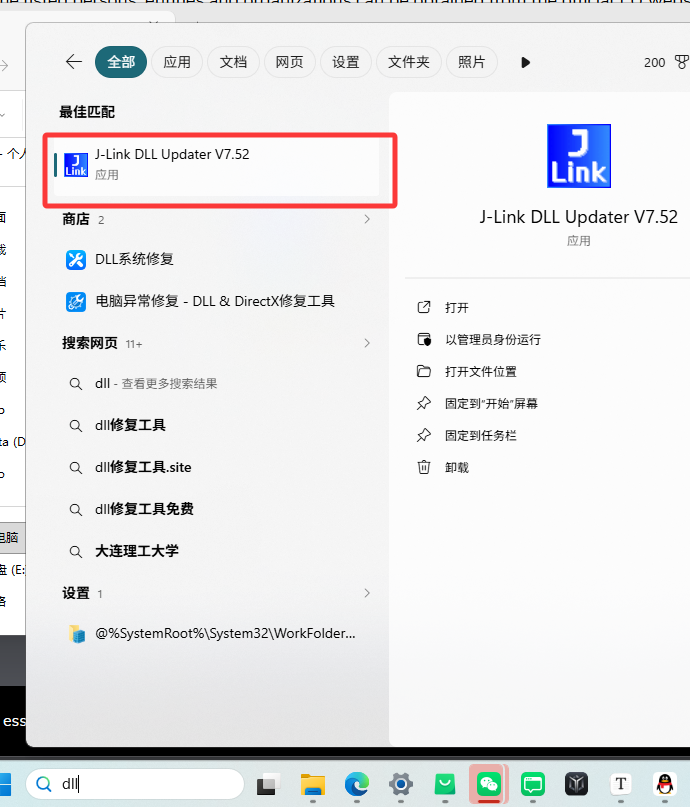

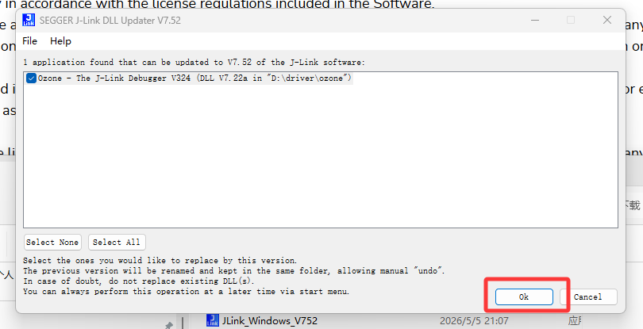

这样就可以使用新版的调试器和老版的驱动

安装完成后请查看ozone使用教程

## vscode+cmake+stm32cube插件安装

目前战队正在使用的工作流是基于cmake的，可爱的cube为我们准备了插件可以帮我们安装编译链之类的

1、前往vscode官网下载软件（安装时注意选择创建桌面快捷方式）

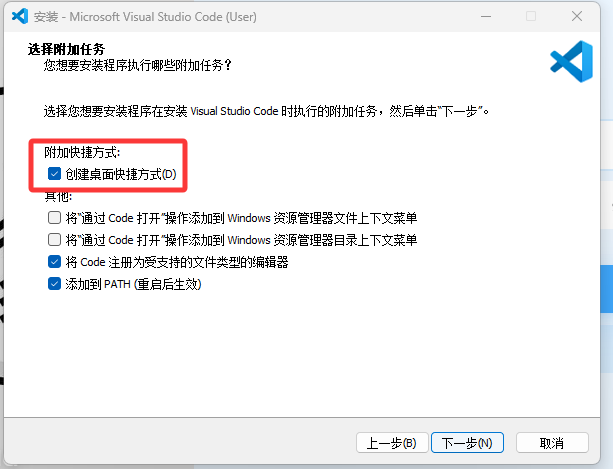

2、进入vscode（建议用github账号登录），安装两个插件

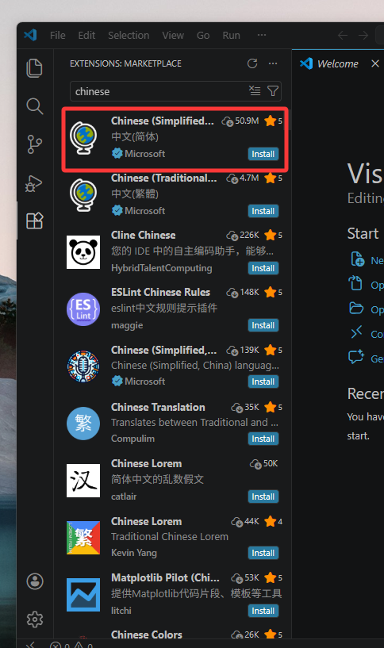

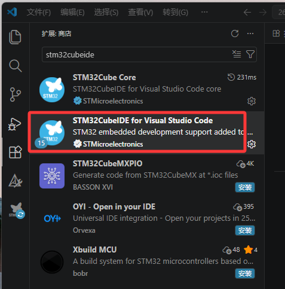

配置完成，后续可看工作流使用说明

## stm32tool+cpkg安装

由于目前队里的包比较多，因此有必要引入包管理以及便于初始化项目的stm32tool

1、进入战队github仓库（[HITSZ-WTRobot/stm32tool: Command line tool for initializing STM32 + Git projects](https://github.com/HITSZ-WTRobot/stm32tool)）

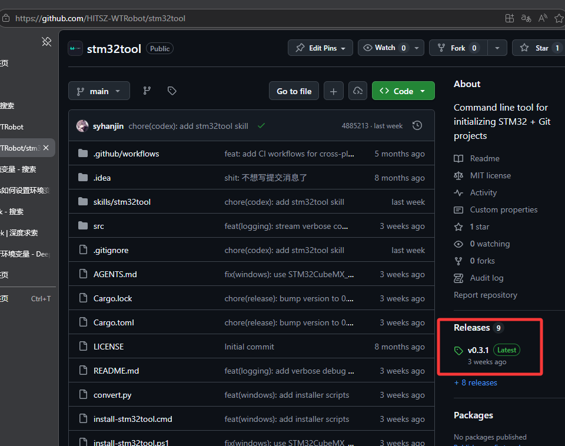

点击release下载

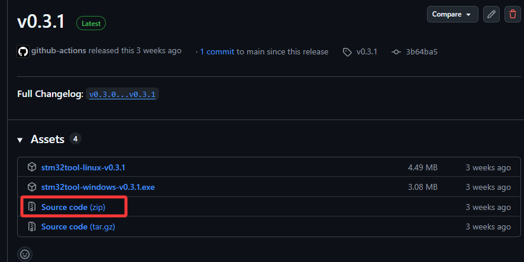

下载完成后解压，运行自动脚本

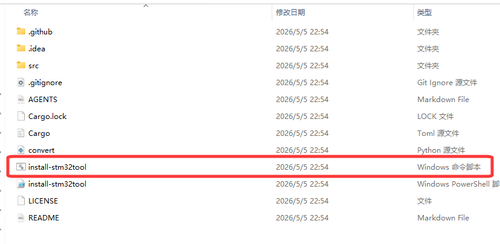

运行过程中需要手动选择一下安装路径，选后即安装完成

2、进入战队驱动库（[HITSZ-WTRobot-Packages/cpkg: 与驱动库搭配使用的一套包管理器](https://github.com/HITSZ-WTRobot-Packages/cpkg)）

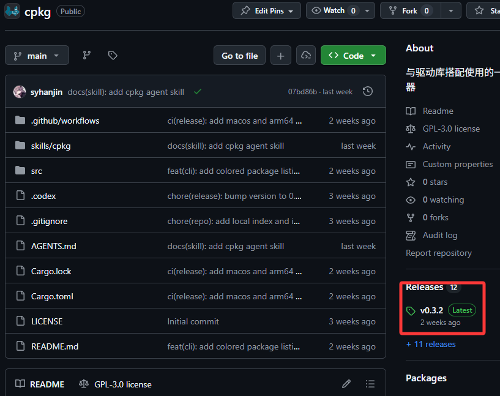

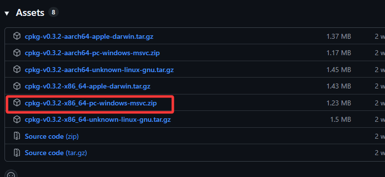

​			下载后解压，修改用户的环境变量

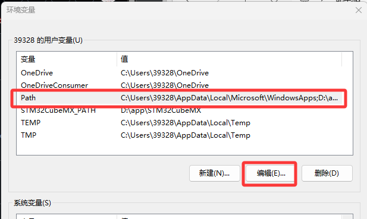

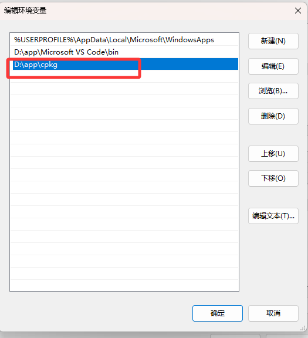

​				将cpkg路径放进去即可
